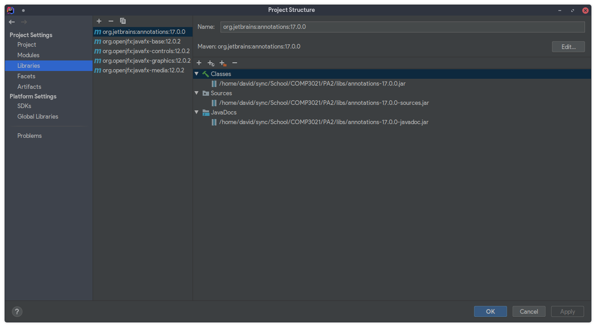
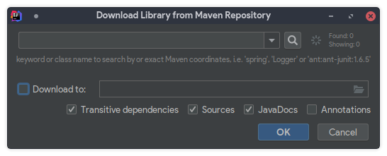

# COMP3021 PA2: Pipes

In PA2, you will be implementing a GUI version of the Pipes game from PA1. The core logic of the game remains the same, 
so your implementation will focus on making the game playable using a GUI.

## Changes from PA1

- All components are now implemented with JavaFX, meaning that you will need to familiarize yourself with JavaFX classes
and functionality
- Most of the text-based game is now moved under the `models` package to facilitate for reuse between the text game and
the GUI game. 
    - The entry point to the text game is now `textgame.Main`
    - The entry point to the GUI game is `main.PipesMain`
    - You may still access the text game by using the `--text` argument when launching the GUI game
    - Please ensure that the text game is still playable after adding the GUI version!

## Setup Notes

Since Java 11, JavaFX has been removed from all JDK distributions, meaning that JavaFX libraries will need to be 
downloaded separately. We will be using the Maven Repository to download our dependencies.

1. Right-click on our project in the Project View, and click on `Open Module Settings`.

2. Navigate to the `Libraries` tab.



3. Click on `New Project Library > From Maven...`. A dialog shown below will appear.



4. Put `org.jetbrains:annotations:17.0.0` into the text box, and click `OK`.

For the bottom checkboxes, the following are the recommended settings:

- Check `Transitive dependencies`.
    - `Transitive dependencies` recursively downloads all libraries which is required by your library.
- Uncheck `Sources`
    - `Sources` includes the source code of your library. We will not need to know the implementation of the libraries.
- Check `JavaDocs`
    - `JavaDocs` includes the JavaDocs of your library.
- Leave `Annotations` to default
    - `Annotations` includes annotation classes which may be used by an annotation processor. We will not be using this.

5. Repeat Steps 3-4 for the following libraries:

```
org.openjfx:javafx-base:12.0.2
org.openjfx:javafx-controls:12.0.2
org.openjfx:javafx-graphics:12.0.2
org.openjfx:javafx-media:12.0.2
```

If you are using Java 13, replace `12.0.2` in the above libraries with `13`.

*Sidenote: Maven classifies libraries using a notation of `<group>:<artifact>:<version>`.*

## Java Concepts

### `java.lang.Thread`/`java.util.TimerTask` Classes

The `Thread` class ([JavaDoc](https://docs.oracle.com/en/java/javase/12/docs/api/java.base/java/lang/Thread.html)) is an
abstract representation of a system thread. Java allows different threads to be run simultaneously.

In a single-threaded Java application (such as your PA1), only the `Main Thread` will be running. With the addition of 
JavaFX in PA2, a new thread called `JavaFX Application Thread` will also be running concurrently. The purpose of the 
Application Thread is to specifically handle UI-related updates at its own pace, which has the benefit of keeping the UI
responsive while the background thread(s) handle computational heavy tasks. Android also uses a similar pattern, forcing
all UI operations to be executable by the UI thread.

`TimerTask` ([JavaDoc](https://docs.oracle.com/en/java/javase/12/docs/api/java.base/java/util/TimerTask.html)) uses 
the `Thread` class to periodically execute a method without blocking other threads.

### `java.nio.file` Classes

In PA1, we used `String` to represent paths on a filesystem. However, `String` can also represent many other types of 
data, and it would be preferable to use classes specific to representing paths.

Since Java 8, Java provides a collection of classes under the `java.nio.file` package to complement the existing 
file-related classes under the `java.io` package. In particular, we will be using these classes in conjunction with 
the `Stream<T>` class to allow for more expressive and efficient code.

### `java.lang.Class<T>` Class

In the provided skeleton of `controllers.SceneManager`, you may notice the use of the `Class<T>` class.

`Class<T>` class ([JavaDoc](https://docs.oracle.com/en/java/javase/12/docs/api/java.base/java/lang/Class.html)) is a 
representation of a class in Java. This class is powerful due to its ability to provide information about a class, 
including its name, methods, member fields, constructors, etc. In addition, it also allows for *reflection*, i.e. the 
ability to modify classes during runtime.

However in PA2, we won't be using any of this. Instead, we will use a `Class` to `Scene` map to easily switch between 
different scenes with one method. 

### Java Module System and JavaFX

Since Java 9, Java has introduced a module system to better modularize different components of a library.

Using this project as an example, under the `src` directory you will see the `module-info.java` file. This file is used 
to declare the properties of this module.

- `module pipes`

Simply declares this module to be named as `pipes`.

- `requires javafx.controls;`

This statement declares that `javafx.controls` is a dependency of this module. In other words, JVM will try to find 
this module in the module path when loading. This replaces the old method of having to specify additional libraries in 
the classpath.

- `exports main;`

This statement declares that our module will expose the package `main` to other modules. The reason for this is when 
the `javafx.application.Application.launch` is invoked, JavaFX will use reflection to call our overridden 
`Application.start` method. However, since the `main` package is not exported, JVM will throw an exception indicating 
that only exported packages can be accessed.

Alternatively, one may also declare the entire package to be an `open module`. However, this is considered poor design 
as this will allow all packages to be accessed externally, breaking encapsulation.

## Tasks

Complete all the TODOs in the entire project. A detailed description of each task is provided in the Javadoc above each 
method. In IntelliJ IDEA, go to `View > Tool Windows > TODO` to jump to each TODO in the project. You may replace the 
placeholder implementation in the methods marked as TODO.

| TODO | Practiced Concepts |
| ---- | ------------------ |
| `AudioManager::playFile` | JavaFX Media, Threads |
| `LevelManager::loadLevelNamesFromDisk` | Filesystem, Streams |
| `Renderer::*` | JavaFX Graphics |
| `ResourceLoader::<clinit>` | Static Initialization |
| `SceneManager::SceneManager` | JavaFX Styling |
| `SceneManager::showPane` | Java Maps, Class |
| `FlowTimer::*` | Timer, Callback Design Pattern |
| `GamePane::*` | JavaFX Controls, Styling |
| `LevelEditorCanvas::*` | JavaFX File Utilities |
| `GameplayInfoPane::bindTo` | JavaFX Bindings |
| `Serializer::*` | File I/O |

All methods not mentioned in the above list practices concepts already visited in PA1.

# An executable jar
We provide an executable jar `PA2_obf.jar` in `PA2_Obfuscated` as a reference implementation. Please take the following steps to run it:
- In the following table, choose one of the JavaFX SDKs to download according to your operating system and the Java version you use. 

|  | Java 12 | Java 13 |
| ---- | ------------------ | ---- |
| Mac | [Download](http://gluonhq.com/download/javafx-12-sdk-mac) | [Download](http://gluonhq.com/download/javafx-13.0.1-sdk-mac) | 
| Windows | [Download](http://gluonhq.com/download/javafx-12-sdk-windows/) | [Download](http://gluonhq.com/download/javafx-13.0.1-sdk-windows/) |
| Linux | [Download](http://gluonhq.com/download/javafx-12-sdk-linux/) | [Download](http://gluonhq.com/download/javafx-13.0.1-sdk-linux/) |

- Open a terminal and change directory to `PA2_Obfuscated`. Make sure `PA2_obf.jar` and `resources` are in `PA2_Obfuscated`.
- Type the following command where `<javafx-sdk-root>` is the path of the JavaFX SDK you have downloaded.
```
java --module-path="<javafx-sdk-root>/lib" --add-modules="javafx.base,javafx.controls,javafx.graphics,javafx.media" -jar PA2_obf.jar
```

For example, if my JavaFX SDK path is `/Library/Java/JavaVM/javafx-sdk-12`, then I should type in the following command in order to run `PA2_obf.jar`:
```
java --module-path="/Library/Java/JavaVM/javafx-sdk-12/lib" --add-modules="javafx.base,javafx.controls,javafx.graphics,javafx.media" -jar PA2_obf.jar
```


# Final Notes

- You are recommended to use the PA2 skeleton code as the basis of your assignment. Although some of the classes (such 
as `models.*` and `textgame.*`) are reused from PA1, they are modified to allow for interoperability between the text 
and GUI variant of the game. Reuse your code at your own risk!
- If a behavior is unspecified in the documentation, you may reference our `PA2_obf.jar` as a reference implementation. 
Alternatively, you may also implement your own behavior as long as it achieves the same intent as our implementation, 
under the discretion of the TA-in-charge.

## Known Issues

- On some Linux distributions, `javafx.scene.media.MediaPlayer` may throw a `MediaException`, with a message like this:

```
MediaException: UNKNOWN : com.sun.media.jfxmedia.MediaException: Could not create player! : com.sun.media.jfxmedia.MediaException: Could not create player!
    <...>
Caused by: com.sun.media.jfxmedia.MediaException: Could not create player!
    <...>
```

This is likely due to missing FFmpeg libraries on the system. You may either install the missing libraries onto your 
system, or use the Virtual Barn to test your implementation to ensure that `MediaPlayer` still works on other platforms.

## Bonus points policy

We will release the grading scheme of PA2 on our course webpage including specific bonus part of PA2.
Please stay tuned to the updates on our course webpage.

**Bonus scheme:** Be used as a "safety blanket" on the assignments capped by the maximum score (e.g. 100).

**Examples:**

* If a student got 95 out of 100 for the basic tasks, but he got 6 bonus points, the final score will be: MIN(95+6, 100) = 100
* If a student got 100 out of 100 and got 0 bonus points, the final score will be: MIN(100+0, 100) = 100
